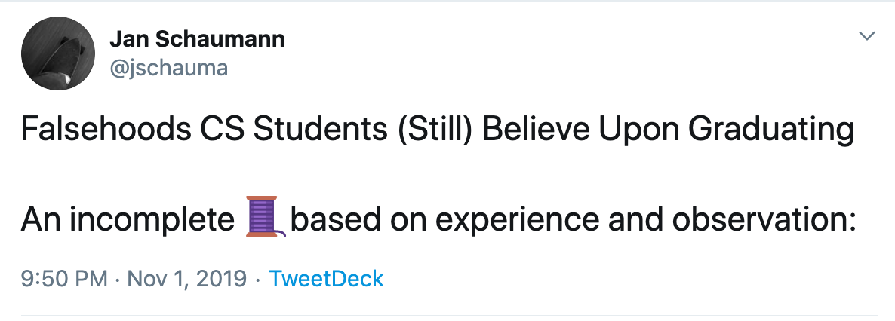
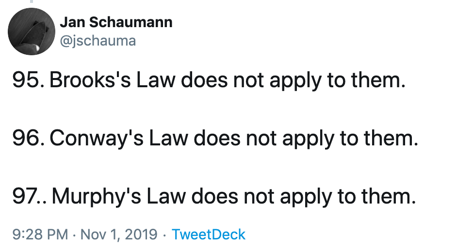
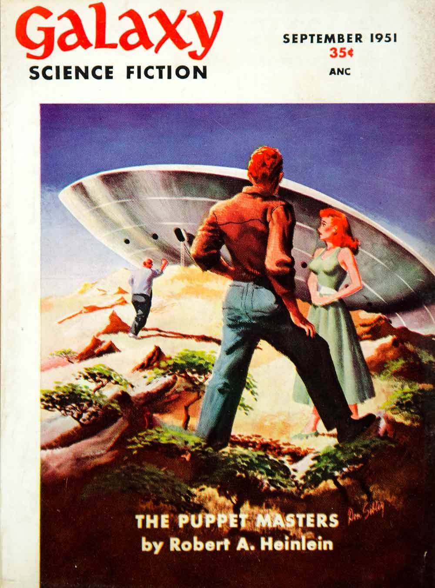
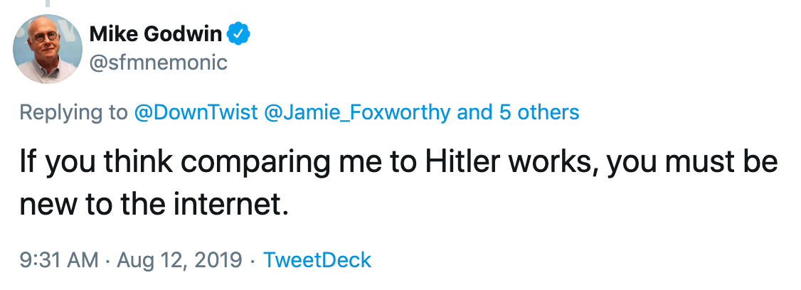
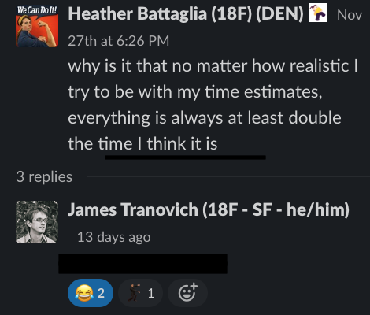
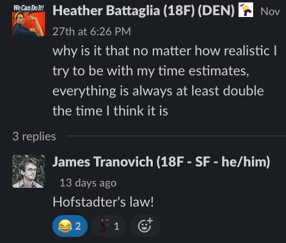

theme: Ostrich, 3
slide-transition: true
slide-transition: fade(0.2)
slidenumbers: true
autoscale: true
footer: @pburkholder
build-lists: true

# Mnemonic Rules for Eponymous Laws

---

# Wait! There's a Law for That....

---

> We're running late so, we're adding more engineers to hit the deadline

---

---

^ Brooks, Conway, Murphy

---

# Brooks's Law

* Adding people to a late software project makes it later,
* The **brook** went over the waterfall
* Fred Brooks

^ Fred Brooks, Mythical Man Month. But this may no longer be true!

---

# Conway's Law

* Organizations which design systems…are constrained to produce designs which are copies of the communication structures of these organizations"
* We **Con**struct systems that mirror the **Way** we communicate
* Melvin Conway

---

# Murphy's Law

* Whatever can go wrong, will
* (I have no mnemonic yet)
* Edward Murphy, 1952

^measurement devices developed by Edward Murphy, coined 1952

---

# Moore's Law

* Computing power doubles every two years
* Every two years, we have **more** computing power
* Gordon Moore

---

# Metcalf's Law

* Network value is proportional to the square of the number of connected users
* Visualize the communication network of, say, New York
* The **Met**ropolitan **Cal***(f)l network value grows with user numbers
* Bob Metcalf

---

# [fit] Maybe the real value of a network
# [fit] is that we **met** a **calf** along the way

---

# Hanlon's Razor

* Never attribute to malice (or conspiracy) that which can be adequately explained by stupidity.
* Apocryphal law, but similar to notions from
* Robert **Heinlein**, author of _The Puppet Masters_

^ Douglas Hubbard ‘Never attribute to malice or stupidity that which can be explained by moderately rational individuals following incentives in a complex system of interactions.’ People behaving with no central coordination and acting in their own best interest can still create results that appear to some to be clear proof of conspiracy or a plague of ignorance

---

---

# Hofstadter's Law

* It always takes longer than you expect, even when you take into account Hofstadter’s Law.
* **Ha!** **Later...**
* Douglas Hofstatder

---

# Godwin's Law

* As an online discussion grows longer, the probability it will involve Nazis approaches 1
* In online discussions, **Go(o)d** never **Wins**
* Mike Godwin, 1980

---

---

# Quiz

---

# Q:

* We've added a DevOps team and now we're further behind schedule

---

# A:

* Brooks's Law 
* `¯\_(ツ)_/¯ `
* Conway's Law

---

---

---

# _fini?_

---

# Laws I haven't added yet

* Miller's Law: To understand, you must believe
* Goodhart's Law: When a measure becomes a target, it ceases to be a good measure.
* Gall's Law: Every working complex system was first a working simple system
