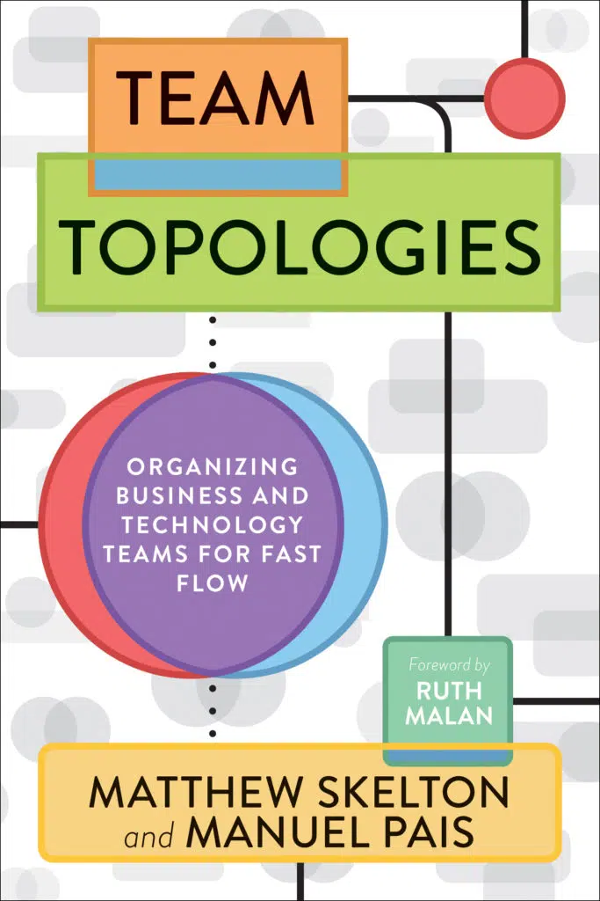
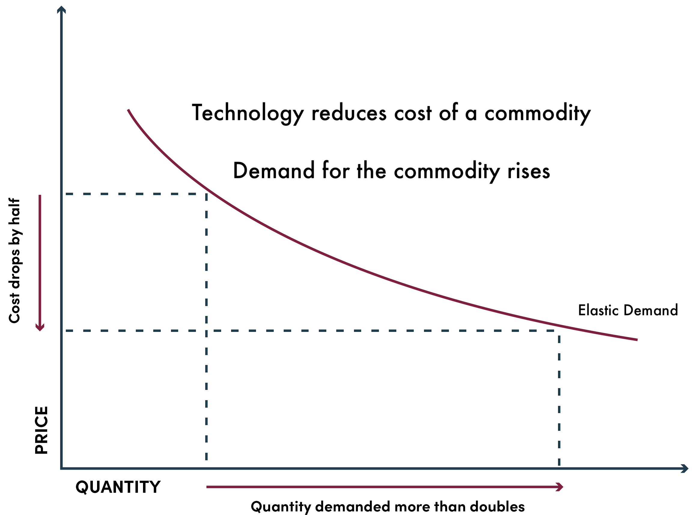
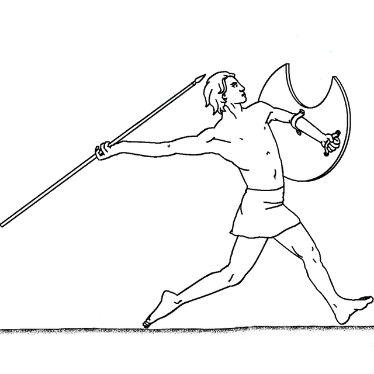
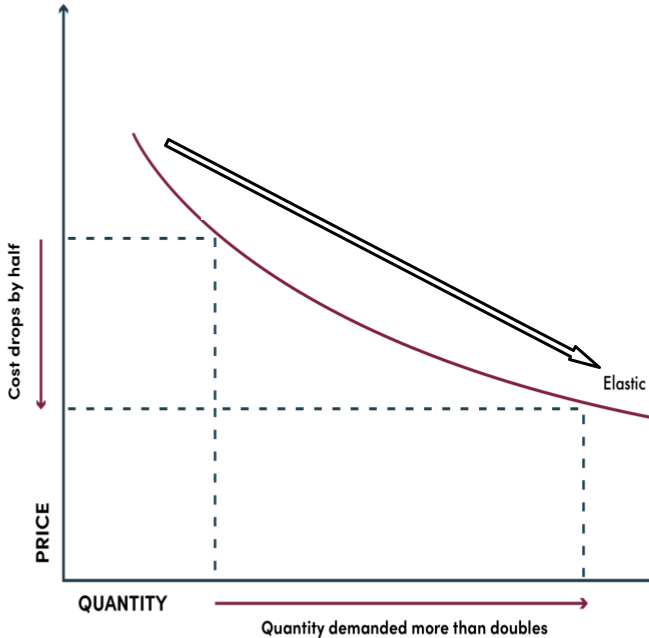
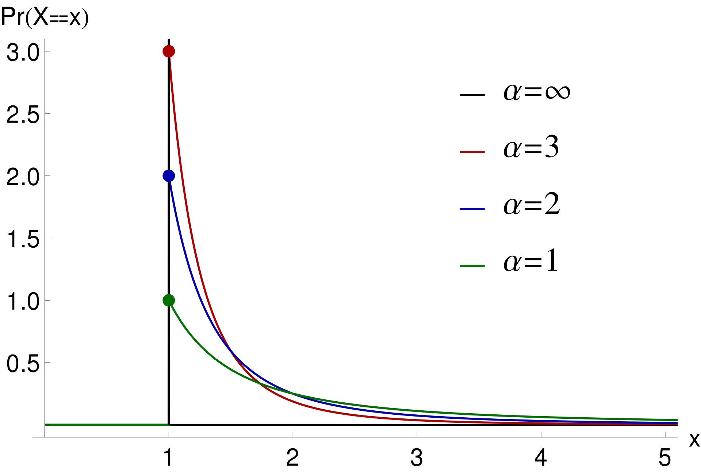
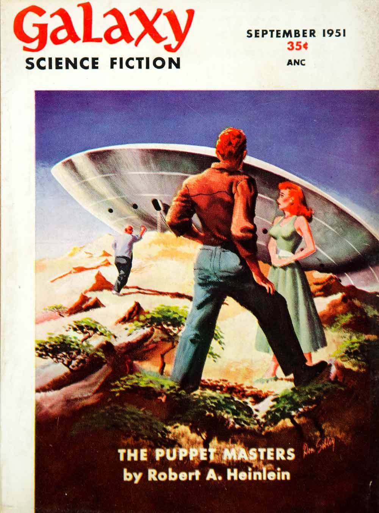

theme: Titillium, 1
slide-transition: true
slide-transition: fade(0.2)
slidenumbers: true
autoscale: true
footer: @pburkholder, 2024 SRECon EMEA
<!-- build-lists: true -->

# Mnemonic Rules for Eponymous Laws

* SRECon EMEA 2024
* Peter Burkholder

[.build-lists: false]

^Good afternoon and thanks for being here. Let's dive in...

---

# Brace yourself...

^ System diagram
^ In 2019 Cloud System
^ CTO and Platform Team
^ System diagram and devops deck

---

^ IAAS & DCs,  Kubernetes and CloudFoundry & Openshift
Windows and RHEL and "Unix/Linux"
All the Databases, A Drupal cherry on top
TWO Hour provisioning

^ DevEx focussed, Delivery enabling
^ security and compliance and governance
^I wasn't in a position to critique 

---

# What I said:

* How are you focussing on user experience without any users?
* Yada, yada, Agile Development... Blah, blah, blah, Lean Enterprise, etc.

# What I needed:

* Eponymous Principle:  a law named for a person (from Greek eponymos "given as a name")
* Mnemonic Rule:  a trick for recall (from Greek mnēmē "memory")

^ So about mnemonic tricks, I like this quote:

---

# Mnemonic Tricks

> To build a memory ... it has to be a little bit weird
-- Per Sederberg (Psychologist, Univeristy of Virginia)

^ weird, gross, or embarrassing.
Make them stick. 
Make them work
I will not apologize for them, PRs welcome
My thought process now

---

^ I see a hopelessly complex system diagram, and 
atop that, I visualize a poo emoji.

---

^poop. and not just metaphorical poo but I ponder literal
feces and the eons long evolution of excrement, that is:

---

# Evolution of Digestion and 💩

* Worm Digestion: 
  * A simple system that works
  * Eats continually, digestive system produces bile continuously
* Human digestion:
  * A complex systems that works
  * We eat big meals, liver stores bile in the **GALL**bladder
* **Gall**: Mnemonic for ...

---

# Gall's Law

* "A complex system designed from scratch never works, and cannot be patched ... to make it work. You have to start ... with a working simple system."
 * _John Gall, M.D. 1975, General Systemantics_
* Every complex system that works has evolved from a simple system that works.
* Mnemonic: Graphic imagery, digestive system, and **GALL** bladders

^ And that's IS how I would respond today w/ complex proposals 

^How this works...  And welcome!

---

# Mnemonic Tricks for Eponymous Principles

* Peter Burkholder _(he/him)_
* US Gov (Cloud.gov), Chef Software, Audax Health, AARP, NIH, Research Labs
* @pburkholder most places
* Geophysicist / Seismologist / Physics Teacher
* So: THERE WILL BE A **QUIZ**

[.build-lists: false]

^Me, some of the places I've worked, and where to find me

---

# The power of Eponymous Principles

* Newton's Laws
  * Law of inertia, etc.
* Murphy's Law
  * Everything that can go wrong will
* Moore's Law
  * Compute power doubles every two years
  
^Not merely rhetorical "argument from authority" but should have 
the backing of experience and empirical evidence. 

---

# What makes for a good eponymous principle?

* True - with empirical evidence, or
* True - with weight of lived experience
* Predictive or explanatory value

^ Consider Gall's Law in this light: It is true from
lived experience and has PREDICTIVE VALUE.

---

# Speaking of predictive value...

^ 2 Weeks provisioning! Over budget
^ Collapsed under its own weight
^ on to our tour of other laws. Likely familiar with:

---

# Conway's Law

"Organizations which design systems…are constrained to produce designs which are copies of the communication structures of these organizations"

* _Melvin Conway, 1968_
* Or: Your architecture will mirror your org chart
* _Mnemonic_: We **CON**struct systems mirroring the **WAY** we communicate
* Application: ...

^Pathological organization cultures and structures
will result in pathological technical systems. 

^ True by Experience, Predictive Value

---

# The Inverse Conway Maneuver

* Build teams to achieve the desired architecture
* Tech: Used bounded contexts and APIs along team bounds
* Orgs: Consider _Team Topologies_ (Skelton & Pais, 2019)

^Thoughtworks blog post 2015.
Matthew Skelton & Manuel Pais, 2019

^Another old chestnut:

--- 

# Brooks Law

"Adding [engineers] to a late software project makes it later"

* _Fred Brooks, 1975, The Mythical Man Month_
* Mnemonic: The **BROOK** went over the waterfall[^1]
* Why: onboarding time + geometrical growth in communication lines

[^1]: James C. **Brooks**, @shootjamesshoot / instagram

^ Water fall - Not dams and Skyscrapers
^ Agile too
^ SW is team members to communicate

---

# Jevons' Paradox

> As the cost of an economically useful commodity decreases,
total expenditure on the commodity grows
-- _William Stanley Jevons, 1865_

* Examples:
  * 1860s: Coal
  * 1970s: Automobile fuel efficiency
  * 2010s: Cloud spend
* See also: Moore's Law

^ James Watt steam engine. Better Efficient per unit Coal
Economist expected end to coal pollution.

^ Cloud spend does not go down with price per compute unit.

---

# Jevons' Mnemonic

* As price goes down
  **J**ust **EVEN** more demand, or
* Falling **JAVE**lin goes ever farther

^ No apologies for mnemonic.

---

# Pareto Principle

The 80/20 rule: 80% of a project is complete in 20% of the time

* _Joseph Juran, inspired by Vilifredo Pareto, 1941_
* Mnemonic: 
  **PARE** down **TO** 80% of work with 20% effort
* Validity: Power-law distribution in process variation
  * or a _Pareto Distribution_

^ Uses: Focus on the 20% most critical findings, 
to take care of 80% of your risk

---

^ Inverse of an exponential curve

---

# Pareto Distributions

* Earthquake magnitudes
* Size of files transferred on a network
* Crimes committed by individuals
* Consecutive nights of being homeless
* Generally: Confounding Factors

---

# Pareto Principle (2)

"In the last six months, we've been able to meet the needs of one-half of our users. We can meet the needs of the other half in another six months"

* Can you spot the problem here?
  
^I'm speculating here, but 

^ Next, consider these words from GK Chesterton:

---

> If you don’t see the use of [a fence]... Go away and think. 
>  
>  When you can ... tell me the use of it, I may allow you to destroy it.
-- G. K. Chesterton, 1929

^ The Foolish Reformer will remove any fence in their way

^ The Intelligent Reformer will say:

---

# Chesterton's Fence

Do not remove a fence until you know why it was put up in the first place.

* Mnemonic: That **CHEST** behind the **FENCE** - it may be a danger!
* Application:
  * Comments, ADRs (Architectural Decision Records), PRs
  * Employee Retention

^ Any project more than a year old, especially platforms...

---

# Meme Laws

* ~~True - with empirical evidence~~
* ~~True - with weight of lived experience~~
* Feel true
* ~~Predictive or explanatory value~~
* Build Community

---

# Meme Laws

### Hanlon's Razor
  "Never attribute to malice what is better explained by incompetence"
  -- _Unknown_
* Mnemonic: Never attribute to _conspiracy_ what is better explained by incompetence
  -- Apocryphally __Robert A. Heinlein__
  

^ No Hanlon known, maybe Heinlein mangled.

---

<!-- # Meme Laws (cont.) --> 

### Cunningham's Law

   "The best way to get the right answer on the internet is not to ask a question; it's to post the wrong answer."
  -- _Ward Cunningham_
  * Mnemonic: Knowledge is COMING HOME when you post the wrong answer

### Hofstadter's Law

   "It always takes longer than you expect, even when you take into account Hofstadter’s Law."
  -- _Douglas Hofstatder, 1979_ 
  * Mnemonic: **Ha!** **Later...**

^TEXT: Then: Hofstader's Law may not be a meme law, 
straddle between meme laws and useful laws.

---

# Whong's Law 

"Every government agency, everywhere is working on a “new system”; It will solve all of their data problems and will be ready to use in 18-24 months."
-- _Chris Whong, 2018_

* Mnemonic: Data throng done long? Wrong, says Whong.
* See also: Gall's Law, Pareto Principle

^The timeline here is key. system will still be 18-24 months away.
^Predictive value: If you come across this: insist that is solve 1 problem for 1 user in 1 month.
(The TTS DevTools team is living this with their work on Rails Template)

---

# Quiz Time

[.column]
* Galls' Law
* Conway's Law
* Brooks' Law
* Jevon's Paradox
* Pareto Principle

[.column]
* Chesterton's Fence
* Hanlon's Law
* Cunningham's Law
* Hofstatder's Law
* Whong's Law

^ I'm going to count down from three, and 
you'll call out the answer. Are you ready for a 
quiz? 3,2,1, ..... (Try again)

---

# What law explains this?

To meet the specified contract deadlines,
we've added a DevOps team. But now we're further behind schedule!

Answer:

* Brooks's Law
* Whong's Law
* Conway's Law
* 

[.build-lists: false]

---

# What law explains this?

To meet the specified contract deadlines,
we've added a DevOps team. But now we're further behind schedule!

Answer:

* **Brooks's Law**
* ~~Whong's Law~~
* ~~Conway's Law~~
* Mnemonic: The **BROOK** goes over the waterfall

[.build-lists: false]
  
---

# Fill in the blank

We have five teams assigned to a system that only has three 
major components. Time to apply an Inverse ________ Maneuver
so we don't end up with five subsystems.

---

# Answer: CONWAY

We have five teams assigned to a system that only has three 
major components. Time to apply an Inverse **Conway** Maneuver
so we don't end up with five subsystems.

* We CONstruct systems the same WAY we're organized

---

# Fill in the blank

This proposed architecture is too complex. We'll have to start
with a simpler initial _working_ solution, otherwise we're doomed
by _______ Law.

---

# Answer: Gall's Law

This proposed architecture is too complex. We'll have to start
with a simpler initial _working_ solution, otherwise we're doomed
by **Gall's Law**.

* 💩 architecture -> digestion -> evolution -> Gall bladder

---

# Fill in the blank

We've met the needs of 80% of our users in two
sprints, so by the ______ ______ we may need another
**eight** sprints for the other 20%.

---

# Answer: Pareto Principle

We've met the needs of 80% of our users in two
sprints, so by **Pareto Principle** we'll need another
**eight** sprints for the other 20%.

---

# How do you respond?

Argument: We're vastly improving the energy efficiency of LLMs, so don't worry about the environmental impact.

Response: Sorry, but are you familiar with ______ ______ ??

^ This is a harder one

---

# Answer: Jevon's Paradox

Argument: We're vastly improving the energy efficiency of LLMs, so don't worry about the environmental impact.

Response: Sorry, but are you familiar with **Jevons' Paradox**??

---

^James and Heather Q

---

^James and Heather A

---

# Thank you

And laws to look forward to in a future version

* Overton Window
* G.I. Joe Fallacy
* Dunning Kruger
* Metcalf's Law
* Parkinson's Law
* Goodhart's Law

---

## Resources

* This talk: https://github.com/pburkholder/eponymous-principles
* Laws of Software: <https://laws-of-software.com>

---

Image rights

* System schematics. Work of U.S. Government, no copyright. Redacted image cleared for use March 22, 2019
* Cover of Godel, Escher, Bach. Image taken by Peter Burkholder. Copyright of the cover
  is held by the Hatchette Group. Per https://www.hachettebookgroup.com/about/faqs/#copyright, 
  > If you deem a usage to fall under “fair use” as established by the U.S. Copyright Office, you do not 
  > need to request permission from us
  This use is Fair Use in a factual context (see also: https://psu.libanswers.com/faq/336502, 
  esp: "they encourage free use of those images to promote their books)
* Cover to Team Topologies, with permission of IT Revolution
* Worm on a plant, https://unsplash.com/photos/a-close-up-of-a-worm-on-a-plant-q30JT3lT91o, used under the UnSplash License
* System Diagrams: US 
* Digestion 
* Roundworm: https://bio.libretexts.org/Bookshelves/Introductory_and_General_Biology/Introductory_Biology_(CK-12)/11%3A_Invertebrates/11.01%3A_Invertebrate_Characteristics
* Human: https://bio.libretexts.org/Bookshelves/Human_Biology/Human_Biology_(Wakim_and_Grewal)/18%3A_Digestive_System/18.3%3A_Digestion_and_Absorption
* Fence: (C) 2024 Allie Burkholder, used with permission
* Brook: (C) 2024 James C Brooks, used with permission
* Jevon's Law: Redrawn from https://www.monitordaily.com/article-posts/jevons-paradox-meets-moores-law-why-ai-will-drive-more-hiring-in-equipment-finance/
  * with Futura
* Javeleer: https://upload.wikimedia.org/wikipedia/commons/thumb/f/fb/Javeleer.png/640px-Javeleer.png
* 