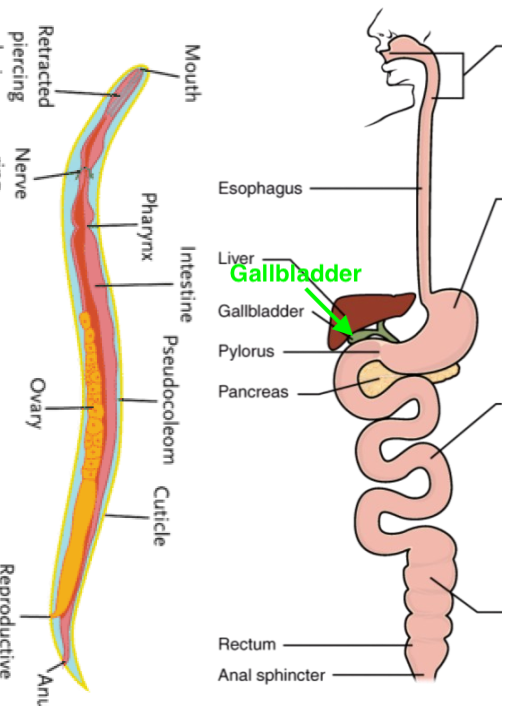

theme: Titillium, 1
slide-transition: true
slide-transition: fade(0.2)
slidenumbers: true
autoscale: true
footer: @pburkholder
build-lists: true

# Mnemonic Rules for Eponymous Laws

* SRECon EMEA 2024

^Good afternoon and thanks for being here. 
I put together the original version of this
as a lightning talk for internal audience a few
years back, and since then I've been thinking, there's some
real meat here, because it's helped me handle
situations like this:

---

# Brace yourself...

^ In 2019 I was a consulting engineer within the US Gov
and I started crossing paths with the CTO team at a US Government
Department that was building a "CloudFactory" on which`
development teams would build, test and run their products. The idea
they couldn't just hand over AWS/Azure/GCP accounts to teams, they
had to work through their "platform"

^The system diagram looked something like this slide
where basically everything from the DevOps landscape
had been vomited up into a tiered system. And my heart sank.

---

^ It may be hard to see, but from the bottom up, you see, data 
centers, AND cloud. Windows, and Linux. CloudFoundry AND Openshift AND 
Kubernetes. Name a Database - there it is. SaaS and PaaS and IaaS.

^ The stated goals were to be developer-friendly and delivery-
focussed with built-in security and compliance.

^So I asked: "And how is this working out for customers ALREADY working
with this system?" 

^And as you might fear: They had no users, and they had no user 
experience team. They we're going to build the system, and it would "just work"

^I sensed that this project was destined to fail.
I knew that from working on teams that practiced lean product
design the importance of getting real customers onto a system
as soon as it provided a working experience.

^I wasn't in a position to critique their
approach, but I wished there was a pithy way to point out the
fundamental misstep they had made.

---

# What I said:

* How are you focussing on user experience without any users?
* Yada, yada, Agile Development... Blah, blah, blah, Lean Enterprise, etc.

# What I needed:

* Eponymous Principle:  a law named for a person (from Greek eponymos "given as a name")
* Mnemonic Rule:  a trick for recall (from Greek mnēmē "memory")

^ I need to reference a well-established eponymous principle,
that is, a one named for a person, from the Greek,
and I would've also need a trick to recall said rule, from the Greek.

^ So about mnemonic tricks, I like this quote:

---

# Mnemonic Tricks

> To build a memory ... it has to be a little bit weird
-- Per Sederberg (Univeristy of Virginia)

^ Good mnemonics are weird, perhaps a little gross, or embarrassing.
^ They stick in your memory. Make them work for you. 
^ So my though process now would run something like this: 
<!-- Per was at OSU in mid-2017, joined UVA in fall of 2017 -->

---

^ I see a hopelessly complex system diagram, and 
atop that, I visualize a poo emoji.

---

^poop. and not just metaphorical poo but I ponder literal
crap and the eons long evolution of poop, that is:

---

# Evolution of Digestion and 💩

* Worm Digestion: 
  * A simple system that works
  * Eat continually, liver produces bile continuously
* Human digestion:
  * A complex systems that works
  * We eat big meals, liver stores bile in the **GALL**bladder
* **Gall**: Mnemonic for ...

^Evolution of Crap and the evolution of digestive systems. Because millions 
of years ago the precursor to our digestive system would've been akin to
a worms's digestive system, where the worm is continually eating,
the liver is continually producing bile to for digestion, and the lower intestine
is continually pooping.

^By contrast, we don't eat continually. We eat meals, sometimes big ones,
and the bile produced by our liver is stored in our Gall bladder so
its available to digest those meals. 

^It's a complex system that works, that evolved from a simple system that
worked

^And now we have our Mnenomic for ...

^ Roundworm: https://bio.libretexts.org/Bookshelves/Introductory_and_General_Biology/Introductory_Biology_(CK-12)/11%3A_Invertebrates/11.01%3A_Invertebrate_Characteristics
^ Human: https://bio.libretexts.org/Bookshelves/Human_Biology/Human_Biology_(Wakim_and_Grewal)/18%3A_Digestive_System/18.3%3A_Digestion_and_Absorption

---

# Gall's Law

* "A complex system designed from scratch never works, and cannot be patched ... to make it work. You have to start ... with a working simple system."
 * _John Gall, M.D. 1975, General Systemantics_
* Every complex system that works has evolved from a simple system that works.
* Mnemonic: Graphic imagery, digestive system, and **GALL** bladders

^So the crappy system diagram brings me around from crap to
worm crap, to human crap, to the Gall bladder, and I can invoke
Gall's Law:

^Every complex system that works has evolved from a simple system that works.

^How this works...  And welcome!

---

# Mnemonic Tricks for Eponymous Principles

* Peter Burkholder _(he/him)_
* US Gov (Cloud.gov), Chef Software, ..., Research Labs
* Geophysicist

^Hi, I'm Peter Burkholder, and welcome to Mnemonic Rule for Eponymous
Principles. I'm currently a customer success engineer for Cloud.gov, the
US Government's Platform-as-a-Service for Public Service. Before that, 
I worked at Chef, Audax Health, the US National Institutes of
Health and various labs 
because I first came into Unix administration as a graduate student in 
seismology.

^I'm glad to be here today to share with you the eponymous principles I have found 
useful in my work, and the mnemonic tricks I use to call them up, some context on how to apply them.

---

# The power of Eponymous Principles

* Newton's Laws
  * Law of inertia, etc.
* Murphy's Law
  * Everything that can go wrong will
* Moore's Law
  * Compute power doubles every two years
  
^There is weight that is not merely
rhetorical "argument from authority" but should have
the backing of experience and empirical evidence. 

^You can't really argue w/ Newton's law (unless relativistic)

^Because
while Murphys Law doesn't have evident per se, it is
still the backbone of our work in Disaster Recovery plan, 
business continuity plans and much else the SRE community does.

^And Moore's Law (paraphrased here) has mostly held true for over 50 years

---

# What makes for a good eponymous principle?

* True - with empirical evidence
* True - with weight of lived experience
* Predictive or explanatory value

^ So, in addition to having "truthiness" is should 
also have predictive or explanatory value

^ Consider Gall's Law in this light: It is theoretically true, and true from
lived experience and has predictive value. 

---

# Speaking of predictive value...

^Indeed, as I expected, the overburdend overcomplex CloudFactory
service collapsed under it's own weight, demonstrating, if not
proving, Gall's Law. So on to our tour of other laws:

---

# Conway's Law

"Organizations which design systems…are constrained to produce designs which are copies of the communication structures of these organizations"

* _Melvin Conway, 1968_
* Or: Your architecture will mirror your org chart
* _Mnemonic_: We **CON**struct systems mirroring the **WAY** we communicate
* Application: ... next slide ...

^Pathological organization cultures and structures
will result in pathological technical systems. This is true
by weight of lived experience AND is has predictive/explantory
value. Consider the .... (next slide)

---

# The Inverse Conway Maneuver

* Build teams to achieve the desired architecture
* Tech: Used bounded contexts and APIs along team bounds
* Orgs: Consider _Team Topologies_ (Skelton & Pais, 2019)

(image: Team Topology cover)

^This technique was named by Thoughtworks in a blog post form 2015.
To apply this, you should definitely consider reading Team Topologies,
the book and the website, by Matthew Skelton & Manuel Pais, 2019

--- 

# Brooks Law

"Adding [engineers] to a late software project makes it later"

* _Fred Brooks, 1975, The Mythical Man Month_
* Mnemonic: The **BROOK** went over the waterfall
* Why: onboarding time + geometrical growth in communication lines

^This is not true just of Waterfall development, but 
Agile too, and there's good theoretical reasons. While a dam
or skyscraper could be built faster with more workers,
SW is constrained by the ability of team members to communicate
about their work. The more engs you have, the more lines of 
communication you have to maintain (let alone onboarding), and 
the more work slows down.

---

# Jevons' Paradox

As the cost of economically useful commodity decreases,
total expenditure on the commodity grows

* _William Stanley Jevons, 1865_
* Mnenomic: Something to do with ancient javelineers
* Examples: 
  * 1860s: Coal
  * 1970s: Automobile fuel efficiency
  * 2010s: Cloud spend
* See also: Moore's Law

^ If anyone you're talking to thinks cloud spend is going to go
down, brandish this. Cloud spend provides returns on your spend
that simply encourage more spend. Same with Coal, and fuel efficiency.

---

Jevons' Paradox illustrated

---

Jevons' Paradox mnemonic

---

&nbsp;

---

# Pareto Principle

"the vital few and the useful many" (or the 80/20) rule

* _Joseph Juran, inspired by Vilifredo Pareto, 1941_
* Mnemonic: _(under construction)_
* 80% of a project is complete in 20% of the time
* Validity: Power-law distribution in process variation
  * or a _Pareto Distribution_

---

# Pareto Principle (2)

"In the last six months, we've been able to 
meet the needs of one-half of our users. We can meet the needs
of the other half in another six months"

* Can you spot the problem here?
  
^I'm speculating here, but FAFSA.... and students
whose parents didn't have SSNs, or had 2000 as birth
year, makes me think...

^SO MUCH SAY HERE! See notes

---

Pareto Principle illustrated

---

Chesterton's Fence 1

---

Chesterton's Fence 2

---

Chesterton's Fence 3

---

<!--- >
###
### FPEC SLIDES 
###
-->

FPEC Overton Window

---

FPEC Dunning Kruger 

---

FPEC Cranstoning

cf. Yak Shaving

---

FPEC Goodhart's Law

--- 

FPEC Hanlon's Razor

---

Metcalf's Law and the success of FPEc

---

G.I. Joe Fallacy

<!--- >
###
### END FPEC SLIDES 
###
-->
---

# Meme Laws

* ~~True - with empirical evidence~~
* ~~True - with weight of lived experience~~
* Feel true
* ~~Predictive or explanatory value~~
* Build Community

---

# Meme Laws

* Cunningham's Law
  * "The best way to get the right answer on the internet is not to ask a question; it's to post the wrong answer."
  * _Ward Cunningham_
  * Mnemonic: Knowledge is COMING HOME when you post the wrong answer
* Hofstadter's Law
  * "It always takes longer than you expect, even when you take into account Hofstadter’s Law."
  * _Douglas Hofstatder, 1979_ (image: GEB cover)
  * Mnemonic: **Ha!** **Later...**

^TEXT: Then: Hofstader's Law may not be a  meme law, nor are 
laws that are corollarys to it, can straddle between meme laws
and useful laws.

---

# Whong's Law 

"Every government agency, everywhere is working on a “new system”; It will solve all of their data problems and will be ready to use in 18-24 months."

* _Chris Whong, 2018_
* Mnemonic: Data throng done long? Wrong, says Whong.

^The timeline here is key. In six months, the system will still be 18-24 months away.
That system diagram we saw in the beginning? How far from completion do you think it way. (Pause)
18-24 months.

* See also: Gall's Law, Pareto Principle

^Predictive value: If you come across this: insist that is solve 1 problem for 1 user in 1 month.
(The TTS DevTools team is living this with their work on Rails Template)

---

# Quiz Time

---

# What law explains this?

To meet the specified contract deadlines,
we've added a DevOps team. But now we're further behind schedule!

Answer:

* Brooks's Law
* Whong's Law
* Conway's Law
* 

[.build-lists: false]

---

# What law explains this?

To meet the specified contract deadlines,
we've added a DevOps team. But now we're further behind schedule.

Answer:

* **Brooks's Law**
* ~~Whong's Law~~
* ~~Conway's Law~~
* Mnemonic: The **BROOK** goes over the waterfall

[.build-lists: false]
  
---

# Fill in the blank

We have five teams assigned to a system that only has three 
major components. Time to apply an Inverse ________ Maneuver
so we don't end up with five subsystems.

---

# Answer: CONWAY

We have five teams assigned to a system that only has three 
major components. Time to apply an Inverse **Conway** Maneuver
so we don't end up with five subsystems.

* We CONstruct systems the same WAY we're organized

---

# Fill in the blank

This proposed architecture is too complex. We'll have to start
with a simpler initial _working_ solution, otherwise we're doomed
by _______ Law.

---

# Answer: Gall's Law

This proposed architecture is too complex. We'll have to start
with a simpler initial _working_ solution, otherwise we're doomed
by **Gall's Law**.

* 💩 architecture -> digestion -> evolution -> Gall bladder

---

# Fill in the blank

We've met the needs of 80% of our users in two
sprints, so by the ______ ______ we'll need another
_____ sprints for the other 20%.

---

# Answer

We've met the needs of 80% of our users in two
sprints, so by **Pareto Principle** we'll need another
**eight** sprints for the other 20%.

---

^James and Heather Q

---

^James and Heather A

---

# Thank you

And laws to look forward to in a future version

[.build-lists: false]

---

# Resources

* This talk: https://github.com/pburkholder/eponymous-principles
* Laws of Software: <https://laws-of-software.com>
